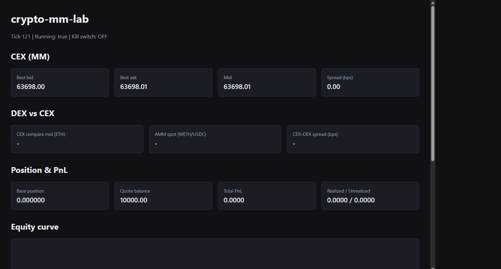
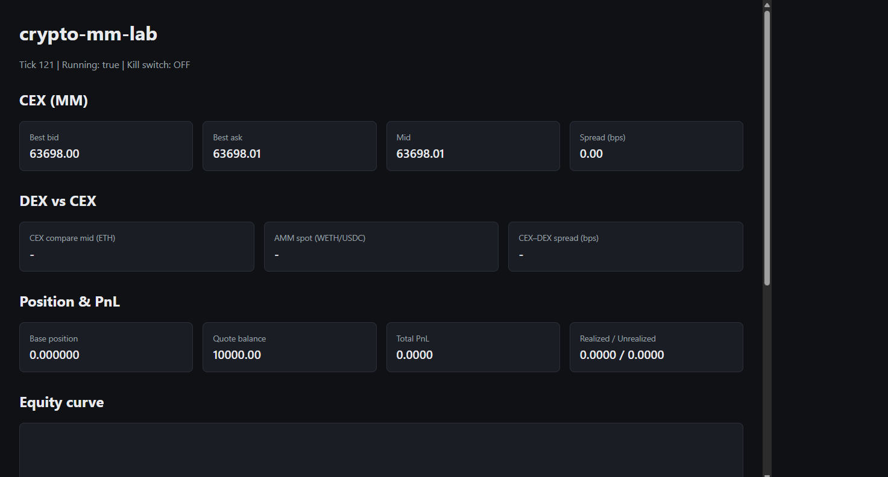
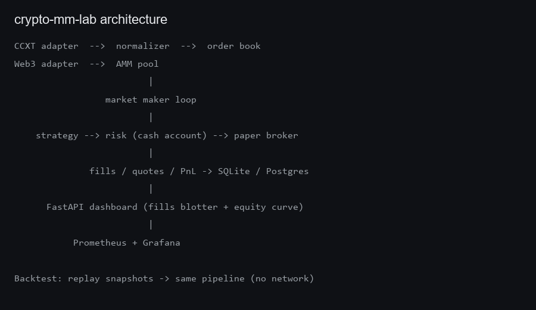
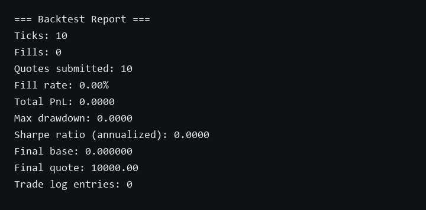
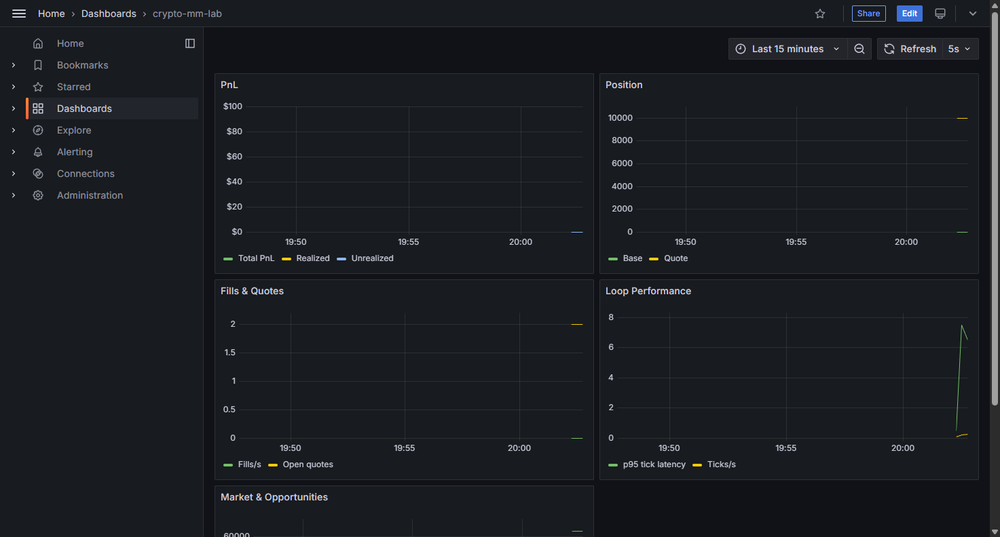

# crypto-mm-lab


[](https://github.com/hudsonferraz/crypto-mm-lab/actions/workflows/ci.yml)

**Paper market-making lab** that pulls live CEX order books, simulates quote placement and fills, tracks PnL, compares CEX vs Uniswap V2 prices, and ships with backtest mode plus a Docker observability stack.

**What it does:** end-to-end MM loop on public Binance data (no API keys).  
**How it's built:** FastAPI, CCXT, web3.py, SQLAlchemy, Prometheus/Grafana.  
**Production gaps:** paper-only, no auth, conservative fill model — see [Simulation assumptions](#simulation-assumptions) and [design decisions](docs/design-decisions.md).



## Screenshots

| Dashboard (live) | Kill switch |
|------------------|-------------|
|  |  |

| Architecture | Backtest report |
|--------------|-----------------|
|  |  |

| Docker stack (live) | Grafana metrics |
|---------------------|-----------------|
|  |  |

## Highlights

- **66 automated tests** — order book math, fill model, PnL, AMM, arbitrage scanner, backtest, API routes
- **3 evolution stages** — V1 CEX paper MM → V2 DEX comparison → V3 Docker + metrics + backtest
- **Observable** — Prometheus `/metrics`, Grafana dashboard, structured logging
- **Replayable** — backtest from SQLite/Postgres snapshots or CSV fixtures (Sharpe, drawdown, fill rate)

## Features

- **V1** — CEX paper market maker (CCXT, pure MM strategy, fill simulation, PnL, dashboard)
- **V2** — Uniswap V2 pool reader, AMM math, arbitrage scanner, inventory skew strategy
- **V3** — Docker Compose stack, PostgreSQL, Prometheus/Grafana, backtest runner

## Quickstart (local)

Requires Python 3.11+.

```bash
cd crypto-mm-lab
python -m pip install -e ".[dev]"
cp .env.example .env
uvicorn app.main:app --reload
```

Open [http://127.0.0.1:8000/dashboard](http://127.0.0.1:8000/dashboard).

### CLI loop

```bash
python scripts/run_mm.py
```

### Backtest

```bash
python scripts/run_backtest.py --fixture tests/fixtures/orderbook_snapshots.csv --strategy pure_mm
python scripts/run_backtest.py --from 2026-01-01 --strategy pure_mm
```

## Docker Compose (full stack)

```bash
docker compose up --build
```

| Service | URL |
|---------|-----|
| App + dashboard | [http://localhost:8000/dashboard](http://localhost:8000/dashboard) |
| Prometheus | [http://localhost:9090](http://localhost:9090) |
| Grafana | [http://localhost:3000](http://localhost:3000) (admin/admin) |

## API

| Endpoint | Description |
|----------|-------------|
| `GET /health` | Health check |
| `GET /metrics` | Prometheus metrics |
| `GET /status` | Loop status, tick count, kill switch |
| `GET /market` | Best bid/ask, mid, spread |
| `GET /position` | Base/quote inventory |
| `GET /pnl` | Realized/unrealized PnL and fees |
| `GET /pnl/history` | PnL time series for equity curve (`?limit=200`) |
| `GET /fills` | Recent trade blotter (`?limit=20`) |
| `GET /report` | Combined status JSON |
| `GET /amm` | WETH/USDC pool price vs CEX ETH mid |
| `GET /opportunities` | Latest arbitrage opportunities |
| `POST /kill-switch` | Enable/disable kill switch (`{"active": true}`) |
| `GET /dashboard` | Static monitoring UI |

## Architecture

See [docs/architecture.md](docs/architecture.md) for the full diagram and data flow.

## Simulation assumptions

This project is a **paper-trading lab**, not a production market-making system. Results are useful for learning and comparison, but they are **not** predictive of live performance. Key simplifications:

### Execution

- **No live orders** — quotes and fills are simulated locally. CEX access is read-only (public order books via CCXT). DEX access is read-only (`getReserves()` over RPC).
- **Cash account only** — you cannot sell base you do not own or bid beyond available quote balance (including fees). No margin, leverage, or short selling.
- **Fill model** (`FILL_MODE`):
  - `full_cross_fill` (default) — if the external best bid/ask crosses your resting quote, the full quote size fills at your price.
  - `partial_fill` — same trigger, but fill size is capped by opposing top-of-book depth.
  - Neither mode models queue position, order-flow priority, or latency.
- **Quote lifecycle** — resting quotes are replaced each tick; partial remainders persist only until the next submission.

### Market data

- **Polling, not websockets** — order books refresh on a fixed interval (default 2s).
- **Top-of-book focus** — strategies quote from mid price; stored snapshots keep best bid/ask only. Backtests reconstruct a minimal two-level book from those prices.
- **Stale fallback** — if a CEX fetch fails, the adapter may reuse the last cached book (flagged `is_stale`).

### PnL and fees

- **Average-cost accounting** — realized PnL uses average entry price, not FIFO.
- **Configurable fees** — maker/taker fees are flat basis-point rates (`MAKER_FEE_BPS`, `TAKER_FEE_BPS`). DEX arbitrage estimates include AMM fee, gas, and slippage assumptions.
- **Unrealized PnL** — mark-to-market on base inventory using current mid.

### DEX comparison (V2)

- **Uniswap V2 only** — constant-product pool math on a single WETH/USDC pair vs CEX ETH/USDT mid.
- **Arbitrage is observational** — opportunities are scanned and logged; no on-chain execution.

### Security and ops

- **No API authentication** — dashboard, kill switch, and JSON endpoints are open on localhost/Docker. Not suitable for exposed deployments without a reverse proxy and auth.
- **No wallet keys** — by design; nothing signs transactions.

For rationale and trade-offs behind each choice, see [docs/design-decisions.md](docs/design-decisions.md).

## Configuration

See `.env.example`. Key variables:

| Variable | Description |
|----------|-------------|
| `EXCHANGE`, `SYMBOL` | CEX data source (default `binance`, `BTC/USDT`) |
| `DB_URL` / `DATABASE_URL` | SQLite (local) or PostgreSQL (Docker) |
| `STRATEGY` | `pure_mm`, `inventory_skew`, or `volatility_spread` |
| `FILL_MODE` | `full_cross_fill` or `partial_fill` |
| `DEX_ENABLED` | Enable on-chain pool reader + arbitrage scanner |
| `METRICS_ENABLED` | Export Prometheus metrics from the loop |

## Development

```bash
ruff check .
pytest -v
```

Regenerate portfolio screenshots and demo GIF (requires a running app for live dashboard captures):

```bash
python scripts/build_portfolio_assets.py
```

## Design decisions

Extended write-up of architecture and simulation choices: [docs/design-decisions.md](docs/design-decisions.md).

## License

See [LICENSE](LICENSE).
