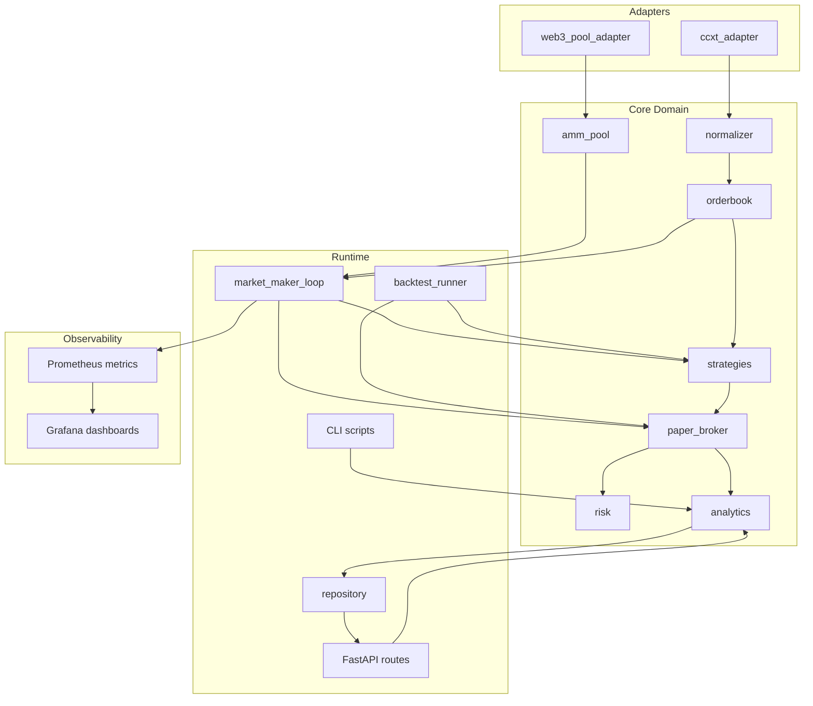

# Architecture

## Overview

crypto-mm-lab is a paper-trading market-making lab that connects to public CEX order books, simulates quote placement and fills, tracks PnL, and compares CEX prices against Uniswap V2 pool data.

## Data flow (live loop)

1. **Fetch** — CCXT public order book (+ optional DEX pool via web3).
2. **Apply fills** — paper broker checks if external prices crossed resting quotes.
3. **Strategy** — generate new bid/ask quotes around mid (pure MM or inventory skew).
4. **Risk** — filter quotes that breach position limits.
5. **Persist** — snapshots, fills, positions, PnL, opportunities to SQLite/Postgres.
6. **Metrics** — expose Prometheus gauges/counters on `/metrics`.

## Backtest flow

1. Load historical snapshots from the database or a CSV/Parquet fixture.
2. Replay through the same strategy → fill → PnL pipeline (no network).
3. Output Sharpe ratio, max drawdown, fill rate, and trade log.

## Storage

| Table | Purpose |
|-------|---------|
| `orderbook_snapshots` | Best bid/ask/mid per tick (replay source) |
| `quotes` | Submitted resting quotes |
| `fills` | Simulated fill events |
| `positions` | Inventory snapshots |
| `pnl_snapshots` | PnL time series |
| `opportunities` | DEX–CEX arbitrage signals |

SQLite is the default for local dev. Docker Compose uses PostgreSQL via `DATABASE_URL` — the repository abstraction makes the swap config-only.

## Deployment stack

`docker compose up` starts:

- **app** — FastAPI + market maker loop
- **postgres** — persistent storage
- **prometheus** — scrapes `/metrics` every 5s
- **grafana** — pre-provisioned dashboard at port 3000
